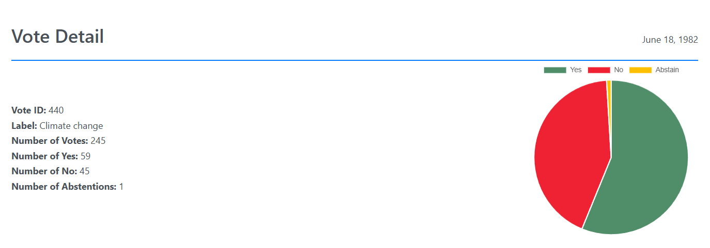
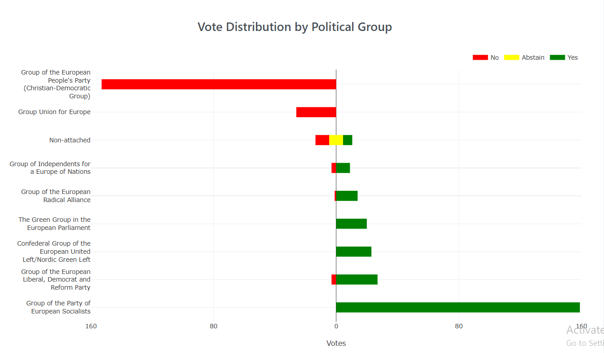

# European Parliament Voting Analysis

## Overview

This web application visualizes the voting patterns of Members of the European Parliament (MEPs) by Political Group over the entire history of the European Parliament, from its first parliamentary term until 2024. Our goal is to help European citizens understand how their representatives have voted on issues, and whether their political groups align with their own beliefs.

This tool is particularly useful for citizens who want to make informed decisions in future elections by seeing how well their MEPs represent their interests.

## Purpose

Imagine you are a German citizen. You might want to know if your MEPs have been voting in alignment with your values and preferences. With this web application, you can:

- See the voting trends of your country’s MEPs over time.
- Compare the voting records of different Political Groups to understand their alignment with key issues.
- Identify representatives or political groups that may not align with your beliefs, helping you make an informed decision for the next election.

## Features

1. Historical Voting Data Visualization: Shows voting patterns by political group and MEP.
2. Country-Specific Insights: Filter and focus on votes cast by MEPs from a particular country.
3. Time-based Analysis: Track voting trends across different parliamentary terms.
4. Political Group Comparison: Compare voting behavior across different political groups to assess ideological consistency.
5. User-Friendly Interface: Clean and intuitive visualizations make it easy for anyone to explore the data.

## Technology Stack

- Backend: Django
- Database: PostgreSQL
- Data Processing: custom ETL scripts
- Frontend: HTML, CSS, JS

## Installation and Setup

### Quick Setup (Recommended)

Run the setup script to install dependencies, migrate the database, and load data:

1. Make the script executable:
   ```bash
   chmod +x setup.sh
   ```
2. Run the setup script:
   ```bash
   ./setup.sh
   ```
3. **Add Required CSV files:**
   - Place the files vote_info.csv and vote_mappings.csv in your database.

### Manual Setup (Alternative)

<details>
<summary>Click to expand detailed setup steps</summary>

1. **Clone the repository:**

   - `git clone https://github.com/matija13795/parliament-votes`

2. **Navigate to the project directory:**

   - `cd parliament-votes`

3. **Install dependencies:**

   - `pip install -r requirements.txt`

4. **Database Initialization:**

   - Create a PostgreSQL database called `my_database`.
   - Update the database configuration in `django_project/settings.py`:
     - On line 83, set `PASSWORD` to your PostgreSQL password.

5. **Run migrations and load initial data:**

   - In the project’s root directory, run the following commands:
     ```bash
     python manage.py makemigrations
     python manage.py migrate
     ```
   - Load MEP data and voting information into the database:
     ```bash
     python manage.py import-mep-data
     python manage.py import-mep-membership-data
     python manage.py import_votes
     ```

6. **Add Required CSV Files:**

   - Place the files `vote_info.csv` and `vote_mappings.csv` in your database.
   - If you’re using PG Admin, you can drag and drop them, or run these commands in your terminal (replace `{PATH_TO_CSV}` with the path to each CSV file on your local machine):
     ```sql
     COPY core_voteinfo(vote_id, code, interinstitutional_file_no, committee_responsible, label, main_policy_issue, date, caller, rapporteur) FROM '{PATH_TO_CSV}' DELIMITER ',' CSV HEADER;
     ```
     ```sql
     COPY core_votemapping(vote_id, mep_id, vote_type) FROM '{PATH_TO_CSV}' DELIMITER ',' CSV HEADER;
     ```

7. **Start the server:**

   ```bash
   python manage.py runserver
   ```

8. **Access the application:**
   - Open your browser and go to [http://localhost:8000](http://localhost:8000) to access the web application.

</details>

## Example Screenshots




